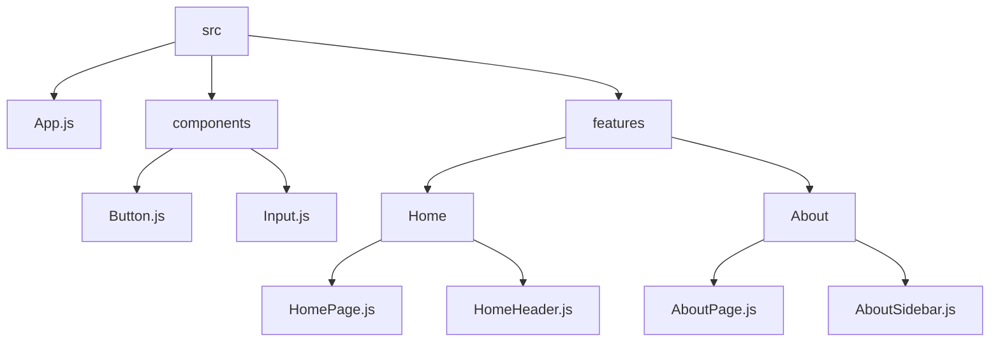

# Files organizations

```g
src
|-- components
|   |-- Button.js
|   |-- Input.js
|   |-- ...
|-- features
|   |-- Home
|   |   |-- HomePage.js
|   |   |-- HomeHeader.js
|   |   |-- ...
|   |-- About
|   |   |-- AboutPage.js
|   |   |-- AboutSidebar.js
|   |   |-- ...
|-- App.js
```


